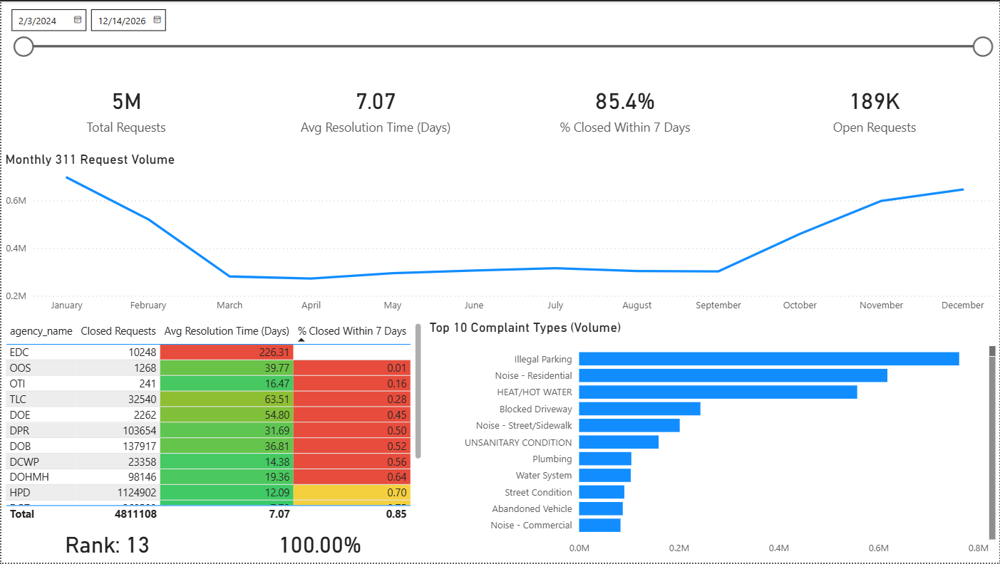

# NYC 311 Service Quality & Operational Performance Dashboard

An end-to-end analytics project modeling 5M+ NYC 311 service requests using a PostgreSQL star schema, true backlog (as-of) logic, and an operational KPI dashboard built in Power BI.

---

---

## Business Objective

New York City’s 311 system processes millions of service requests annually across agencies (housing, sanitation, noise, infrastructure, etc.).

City leadership requires visibility into:

- Volume trends & seasonality
- Resolution efficiency
- SLA compliance
- Backlog accumulation
- Borough-level hotspots
- Agency bottlenecks

Raw open data is large and not decision-ready.  
This project transforms it into a structured analytics model and executive-ready performance dashboard.

---

## Technical Architecture

**Data Source:** NYC Open Data (311 Service Requests)  
**Ingestion:** API → CSV → PostgreSQL staging  
**Modeling:** Star schema  

Fact Table:
- `fact_311_requests`

Dimension Tables:
- `dim_date`
- `dim_agency`
- `dim_complaint_type`
- `dim_borough`

**Visualization:** Power BI (multi-page dashboard)

Schema diagram available in `/docs/schema.png`

---

## Dashboard Pages

1. Executive Overview
2. Operational Trends (Rolling volume + True backlog)
3. Borough Performance Analysis
4. Agency Drill-Through Deep Dive

Screenshots available in `/docs/dashboard_screenshots/`

---

## Key Analytical Enhancements

- True historical backlog calculation (created + closed timestamp logic)
- Rolling 7-day demand smoothing
- SLA compliance tracking (≤ 7 days)
- Agency ranking by performance
- Resolution-time distribution analysis

---

## Repository Structure
sql/ → Production SQL scripts
docs/ → Insights, KPIs, data dictionary, architecture, Screenshots
pbix/ → (Not included – see link below)

---

## Download Dashboard

Power BI (.pbix) file available here:

[Download PBIX File](https://drive.google.com/file/d/12NjrbvSaLXZ5ZbcQLxaovRwWsoIrb8Jy/view?usp=sharing)

---

## Documentation

- [Insights & Recommendations](docs/insights_and_recommendations.md)
- [KPI Definitions](docs/kpi_definitions.md)
- [Data Dictionary](docs/data_dictionary.md)
- [Technical Architecture](docs/technical_architecture.md)
- [Dashboard Screenshots](docs/dashboard_screenshots)

---

## Project Outcome

This project demonstrates:

- Dimensional data modeling
- SQL-based analytics engineering
- Operational KPI design
- Executive dashboard development
- Analytical storytelling with actionable recommendations